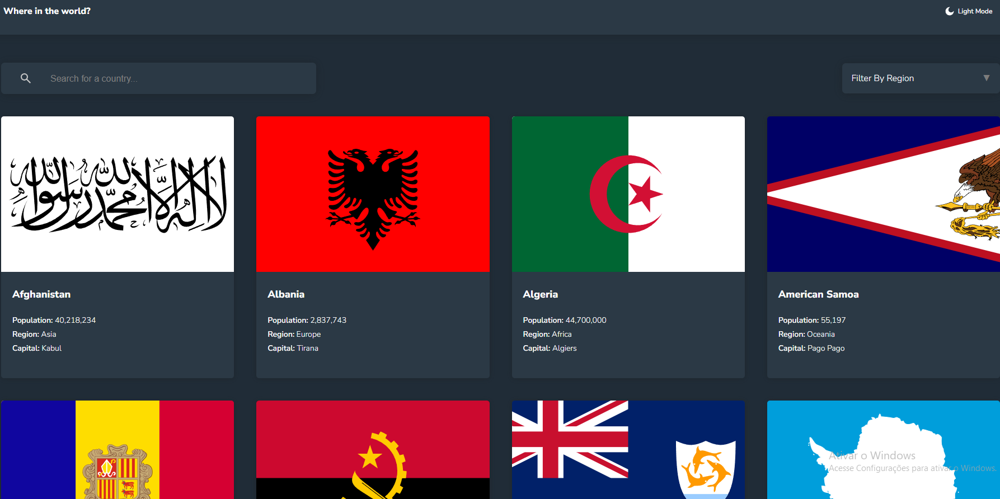

# Frontend Mentor - REST Countries API with color theme switcher solution

This is a solution to the [REST Countries API with color theme switcher challenge on Frontend Mentor](https://www.frontendmentor.io/challenges/rest-countries-api-with-color-theme-switcher-5cacc469fec04111f7b848ca). Frontend Mentor challenges help you improve your coding skills by building realistic projects.

## Table of contents

- [Overview](#overview)
  - [The challenge](#the-challenge)
  - [Screenshot](#screenshot)
  - [Links](#links)
- [My process](#my-process)
  - [Built with](#built-with)
  - [What I learned](#what-i-learned)
  - [Continued development](#continued-development)
- [Author](#author)

## Overview

### The challenge

Users should be able to:

- See all countries from the API on the homepage
- Search for a country using an `input` field
- Filter countries by region
- Click on a country to see more detailed information on a separate page
- Click through to the border countries on the detail page
- Toggle the color scheme between light and dark mode _(optional)_

### Screenshot

### Links

- Solution URL: [Click Here](hhttps://github.com/sirbiel100/Country-Search)
- Live Site URL: [Click Here](https://your-live-site-url.com)

## My process

### Built with

- Semantic HTML5 markup
- SASS custom properties
- Flexbox
- CSS Grid
- Mobile-first workflow
- [React](https://reactjs.org/) - JS library
- React Hooks - useState, useRef, useContext, useEffect, useCallback
- [Next.js](https://nextjs.org/) - React framework
- [Sass](https://sass-lang.com/) - For styles

### What I learned

I learned how to use better the react ref to track some element on screen.

### Continued development

I want to continue focusing on frontend, frameworks and things that could challenge me in this area to be a better programmer.

## Author

- Website - [My Portfólio](https://sass-lang.com/)
- Frontend Mentor - [@sirbiel100](https://www.frontendmentor.io/profile/sirbiel100)
- LinkedIn - [Gabriel Crispim](https://www.linkedin.com/in/gabrielrcrispim/)
